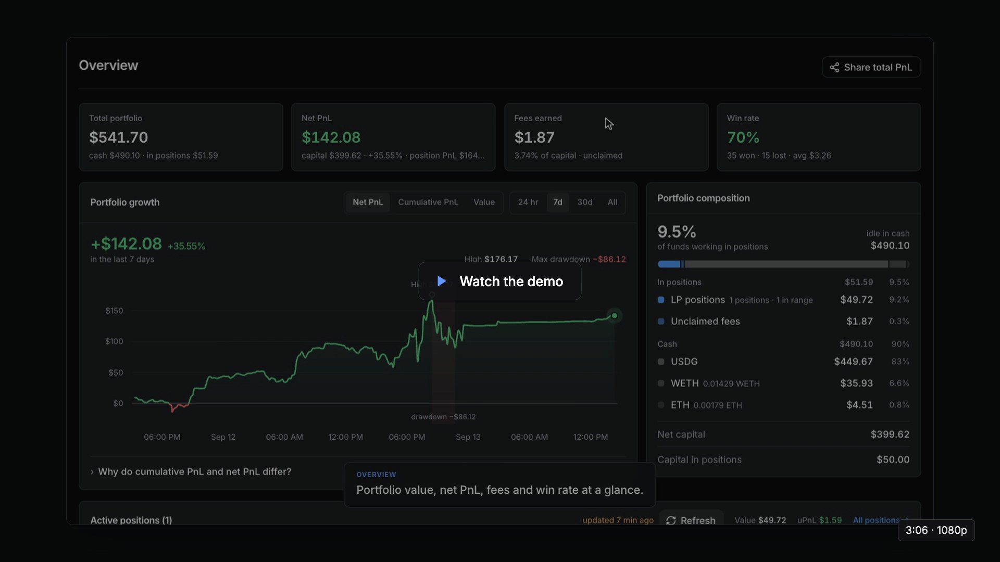

# Quiver — copy-LP untuk Robinhood Chain

<p align="center">
  <a href="docs/quiver-demo-en.mp4">
    
  </a><br />
  <sub>Tur dasbor bernarasi (3:06, narasi Inggris). Alamat wallet dan nama target disensor. <a href="docs/quiver-demo-en.srt">Subtitle</a></sub>
</p>

Mencermin posisi likuiditas (LP) Uniswap **v4 dan v3** dari satu atau banyak wallet
target di Robinhood Chain (chainId 4663), dengan dashboard untuk memantau dan menyetel
semuanya. Default-nya **mode simulasi** — tidak mengirim transaksi sampai kamu
menyalakannya sendiri.

```
./lp                       # jalankan mesin + dashboard (http://127.0.0.1:8799)
./lp scout 0xABC… [blok]   # periksa sebuah wallet sebelum dicopy
./lp add 0xABC… "label"    # tambah target dari terminal
./lp list                  # daftar target
```

## Di mana jalannya

**Produksi: VPS Singapore** (`ssh singapore`), sebagai proses pm2 `lpcopy`.
Dasbor: URL tunnel kamu sendiri (lewat cloudflared tunnel, butuh token akses);
simpan alamatnya di `.env` sebagai `LPCOPY_DASHBOARD_URL`, bukan di repo.

```bash
ssh singapore
pm2 status lpcopy          # status
pm2 restart lpcopy         # restart
pm2 logs lpcopy --lines 50 # log
pm2 stop lpcopy            # hentikan
```

Kenapa Singapore, bukan zeroserver: latensi RPC **281ms stabil** vs **465ms sangat
berayun** (346–731ms) di zeroserver, dan DNS-nya bersih — zeroserver kena hijack
Telkomsel yang sama seperti Mac. Kestabilan lebih penting daripada angka rata-rata.

**Deploy ulang setelah edit di Mac.** Kirim kode saja; `config.json`, `data/`, dan
`logs/` hidup di server (config berisi token akses, data berisi kursor blok — kalau
ikut ter-push, kursor mundur dan aksi lama dinilai ulang).

```bash
cd ~/lpcopy
rsync -az --exclude node_modules --exclude data --exclude logs --exclude config.json \
  src public package.json README.md lp singapore:~/lpcopy/
ssh singapore 'pm2 restart lpcopy'
```

**Rahasia di `.env`.** Token dan kunci boleh dipindah dari `config.json` ke `~/lpcopy/.env`
(`cp .env.example .env && chmod 600 .env`): `LPCOPY_PRIVATE_KEY`, `LPCOPY_AUTH_TOKEN`,
`LPCOPY_TELEGRAM_BOT_TOKEN`, `LPCOPY_NTFY_TOPIC`, dan variabel bebas yang dirujuk dari URL/header
RPC sebagai `${NAMA}` (mis. `.../v2/${ALCHEMY_KEY}`). Urutan: variabel lingkungan > `.env` >
`config.json`. Nilai dari `.env` tidak pernah ditulis balik ke `config.json`, dan dasbor menolak
mengubah kolom yang diatur `.env`. `.env` tidak masuk git dan tidak ikut `deploy.sh`.

**Token akses** ada di `~/lpcopy/config.json` di server (`server.auth_token`, chmod 600) — atau di `.env` sebagai `LPCOPY_AUTH_TOKEN`.
Dasbor ini bisa menyalakan mode LIVE dan menutup posisi, jadi ia tidak boleh terbuka
tanpa token begitu diekspos — token kosong = gerbang mati (hanya aman untuk 127.0.0.1).

## Cara kerjanya

**Deteksi lewat event, bukan decode transaksi.** Target contoh (`0xe1d7…3e79`) memakai
tiga jalur sekaligus: PositionManager langsung, `V4UtilsRouter` (layanan otomasi
ber-role `AUTOMATION_OPERATOR`), dan UniversalRouter. Kalau bot membaca calldata, ia
harus mengejar setiap router baru selamanya. Semua jalur itu bermuara ke event yang
sama, jadi itulah yang dipantau:

| Venue | Sumber | Cara mengenali pemilik |
|---|---|---|
| Uniswap v4 | `PoolManager.ModifyLiquidity` | `salt` event = `tokenId` PositionManager → `ownerOf` |
| Uniswap v3 | `NPM.IncreaseLiquidity` / `DecreaseLiquidity` | `tokenId` terindeks → `ownerOf` |
| keduanya | `Transfer` ERC-721 | posisi berpindah/dibakar |

Alamat yang terpakai (semua diverifikasi di chain):

```
PoolManager v4    0x8366a39cc670b4001a1121b8f6a443a643e40951
PositionManager   0x58daec3116aae6d93017baaea7749052e8a04fa7
NPM v3            0x73991a25c818bf1f1128deaab1492d45638de0d3
UniversalRouter   0x8876789976decbfcbbbe364623c63652db8c0904
Permit2           0x000000000022d473030f116ddee9f6b43ac78ba3
USDG (6 desimal)  0x5fc5360d0400a0fd4f2af552add042d716f1d168
WETH9             0x0bd7d308f8e1639fab988df18a8011f41eacad73
```

## Tabel posisi

Tiap baris: lambang pasangan, chip venue + tokenId, umur, modal, nilai, fee total
(sudah ditarik + belum diklaim, rinciannya di tooltip), PnL, DPR, rentang harga, dan
waktu. Ada ringkasan di kepala panel dan baris total di kaki tabel.

**Logo token**: Blockscout menyimpan `icon_url` tiap token, tapi Blockscout membalas
403 dari server (Cloudflare memeriksa sidik jari TLS — header apa pun tidak menolong),
sementara CDN gambarnya sendiri bisa diakses. Karena aset kuotasi (USDG/WETH/ETH)
selalu menjadi salah satu dari setiap pasangan, logo ketiganya diunduh sekali ke
`web/public/tokens/` dan disajikan dari server sendiri — jadi setiap baris pasti punya
minimal satu logo asli, tanpa permintaan ke pihak ketiga. Memecoin memang tidak punya
logo di mana pun, jadi memakai lambang yang dibangkitkan dari alamatnya (warna selalu
sama untuk alamat yang sama).

## Kolom rentang

Menampilkan rentang **harga** posisi (mis. `0,00032 – 0,00201 USDG`), bar sumbu
logaritmik dengan penanda harga sekarang, dan jarak ke tepi terdekat
(`di dalam · 27% ke tepi atas`) — yaitu berapa persen harga harus bergerak sebelum
posisi berhenti menghasilkan fee. Sebelumnya kolom ini hanya menampilkan lebar dalam
persen, yang tidak memberi tahu di harga berapa posisi bekerja.

Arahnya ditentukan `quoteSide`: kalau aset kuotasi berada di token0 (mis. pool
USDG/MEME), harga token spekulatif adalah **kebalikan** dari tick — `tickLower` justru
menghasilkan harga tertinggi. Diverifikasi dengan membandingkan dua susunan pool yang
setara: keduanya menghasilkan angka yang sama.

## Riwayat posisi (laci di halaman Posisi)

Klik baris posisi (terbuka maupun tertutup) → laci dari kanan berisi PnL, umur, fee,
modal, lalu **riwayat transaksi** posisi itu: swap zap, mint, tambah, kurangi, tutup,
jual sisa — dengan jumlah token, nilai USD, gas, hash (tautan Blockscout), dan alasan
keputusan yang memicunya. Di bawahnya **catatan bot**: keputusan atas aksi target yang
menaut ke posisi ini dan baris log yang menyebut `#<id>`. Sumbernya tabel `txs`
(detail JSON menyimpan nomor posisi/pool), `decisions`, dan `logs`
(`GET /api/position/history?id=`); posisi yang diadopsi tanpa tx tetap punya kejadian
buka/tutup dari baris posisinya. Uji: `node test/riwayat.js`.

## Isi wallet target (halaman detail target)

Di atas kinerja LP, halaman detail target menampilkan **isi wallet**-nya: semua token
yang dipegang beserta jumlah, harga, nilai USD, dan porsinya terhadap total. Kandidat
tokennya dirakit dari aset kuotasi, token posisi LP-nya, token yang dikenal bot, dan
log `Transfer` ERC-20 ke alamat itu (~1 hari terakhir, bertahap); saldonya dibaca satu
batch dari chain, harganya dari DexScreener (`GET /api/wallet/holdings?address=`).

## Riset wallet (tab **Wallet**)

Buka wallet mana pun → total profit, win rate, fee, rata-rata modal, kalender profit
harian, profil gaya ber-LP (porsi in-range, lebar rentang, ukuran dan umur posisi yang
khas), posisi berjalan, dan seluruh riwayat posisi. Semua disimpan di SQLite
(`wallets`, `wpositions`, `wevents`, `wprices`), jadi membuka ulang tidak memanggil chain.
Tombol ⟳ memindai ulang; opsi **Semua riwayat** memindai sejak awal chain (~10 menit
untuk ~150 posisi, sekali saja).

Dibandingkan dengan LP Agent untuk `0x4876…80a0` (seluruh riwayat): posisi ditutup
145 vs 146, win rate 81,55% vs 82,39%, fee $2.620,46 vs $2,62k, rata-rata modal
$591,91 vs $589,08. API LP Agent sendiri tidak bisa dipakai — dijaga Cloudflare,
403 bahkan untuk browser sungguhan.

**Cara menghitungnya — dan kenapa bukan dari Transfer token.** Versi pertama menghitung
modal/hasil dari Transfer ERC20 di tiap transaksi. Itu gagal pada **rebalance otomatis**:
router menutup posisi lama dan membuka yang baru dalam satu unlock, flash accounting
PoolManager me-netting dananya, dan **tidak ada Transfer sama sekali** — 42 posisi
terbaca "hasil = modal, fee nol", dan win rate jatuh ke 57%. Versi sekarang membaca
state pool dan posisi **di blok sebelum tiap kejadian** lewat node arsip:
- pokok = dari L, rentang, dan `sqrtPriceX96` saat itu
- fee = `L × (feeGrowthInside − feeGrowthInsideLast) / 2^128` saat itu

Keduanya eksak (fee hasil metode ini identik sampai digit terakhir dengan
"token keluar − pokok" pada transaksi yang tidak ter-netting). Kejadian **klaim fee**
(delta likuiditas nol) juga dihitung — versi awal melewatinya dan kehilangan
$6,68 fee pada satu posisi.

**Terealisasi vs belum, setelah posisi tutup.** Menutup posisi USDG/MEME mengembalikan
USDG **dan** MEME — MEME-nya belum jadi uang sampai ditukar, dan memecoin biasa turun
50–80% lagi antara tutup dan jual. Riwayat posisi karena itu mengikuti token non-kuotasi
setelah tutup (`src/proceeds.js`): USDG/ETH/WETH yang diterima langsung **terealisasi**;
token lain dilacak lewat Transfer keluar dari wallet — kalau di tx yang sama ada aset
kuotasi masuk, itu penjualan dan **hasil sesungguhnya** yang dipakai (jual 1 juta token
kena price impact & fee router; hasil ke ETH native dibaca dari selisih saldo + gas,
dihargai kurs ETH/USDG blok itu); kalau tidak ada yang masuk (dikirim ke wallet lain /
ditukar ke memecoin lain), dinilai harga pool blok itu. Yang belum keluar = **masih
dipegang**, dinilai harga pool sekarang tiap halaman dibuka — PnL posisi tertutup ikut
bergerak sampai tokennya dijual, lalu terkunci. Penjualan dialokasikan FIFO antar-posisi
yang menerima token yang sama; saldo yang sudah ada sebelum posisi pertama dihabiskan
dulu. Kolom PnL menampilkan pembagiannya (`terealisasi $x · $y dipegang`). Dua posisi
memecoin wallet acuan yang oleh tracker pihak ketiga (harga dari feed yang basi) tampil
"+$287 / +$181" ternyata di chain **−$344 / −$170** begitu hasil jual ETH-nya dihitung.

**Node arsip: hanya `rpc.ordofi.network`** (`archive: true` di config). Endpoint resmi
membalas "metadata is not found" untuk blok lampau, publicnode 403. Tanpa node arsip,
mesin jatuh ke cadangan: harga dari event Swap terdekat (bisa meleset untuk memecoin)
+ jumlah dari Transfer, dengan pengaman bahwa pokok tidak boleh melebihi yang diterima.

**Batas getLogs per endpoint** (`max_log_blocks`): ordofi menggantung ~60 detik lalu
membalas "network is busy" untuk rentang 40rb blok, sedangkan endpoint resmi menjawab
query terfilter alamat untuk **900rb blok dalam 0,34 detik**. Itulah kenapa enumerasi
memakai potongan 1 juta blok dan ordofi dibatasi 3.000 blok (cukup untuk mesin copy yang
cuma memindai blok terbaru).

### Uniswap v3

Rekonstruksi v3 punya jalur sendiri (`src/walletv3.js`) dan justru lebih murah
daripada v4: NonfungiblePositionManager memancarkan jumlah tokennya langsung dan
memisahkan pokok dari fee dengan sendirinya —

```
IncreaseLiquidity(tokenId indexed, liquidity, amount0, amount1)   modal masuk
DecreaseLiquidity(tokenId indexed, liquidity, amount0, amount1)   POKOK yang ditarik
Collect(tokenId indexed, recipient, amount0, amount1)             yang benar-benar diterima
```

sehingga **fee = Collect − Decrease**, dihitung berjalan supaya klaim fee tanpa
penarikan (Collect tanpa Decrease) ikut terbaca utuh. Ketiganya mengindeks tokenId,
jadi seluruh riwayat sebuah wallet bisa diambil satu kueri per rombongan tokenId.

Tiap kejadian dinilai pada harga pool **di bloknya sendiri** — memakai harga sekarang
untuk modal yang disetor seminggu lalu menghasilkan PnL yang menyesatkan. Kalau harga
blok itu sama sekali tidak terbaca, sisi kuotasi tetap dinilai persis (ia memang
uangnya) dan posisinya ditandai taksiran; menilai seluruh kejadian nol akan membuat
posisi tampak bermodal nol.

**Sumber harga: event `Swap`, BUKAN node arsip** — kebalikan dari jalur v4, dan itu
disengaja. Terukur pada satu posisi nyata: arsip menjawab `4,26e32` untuk blok keluar,
sementara tiga `Swap` berturut-turut sesudahnya (jarak 9, 13, dan 92 blok) sepakat di
`~2,0e33`, tanpa satu pun `Swap` di antaranya yang bisa menjelaskan selisih 4,7× itu —
menarik likuiditas tidak menggerakkan harga di Uniswap v3. Beberapa menit kemudian
node yang sama menolak blok itu (`missing trie node`), jadi jawaban sebelumnya berasal
dari state yang sudah tidak utuh. Selisihnya bukan kosmetik: PnL wallet yang sama
berayun dari **−$19rb ke +$231rb** tergantung sumber mana yang dipakai. Log event
adalah bagian dari bloknya sendiri dan tidak bisa salah; arsip hanya dipakai kalau
tidak ada `Swap` yang bisa ditemukan sama sekali.

**Posisi yang NFT-nya sudah dibakar tetap masuk riwayat.** `positions()` tidak
menjawab lagi untuk NFT yang dibakar, tetapi transaksi pembukaannya masih ada dan
kontrak POOL memancarkan `Mint` di situ — alamat lognya ADALAH alamat poolnya, dan
tick-nya ada di topiknya. Tanpa pemulihan ini, wallet yang rajin membakar NFT-nya
kehilangan lebih dari separuh riwayatnya, dan yang tersisa condong ke posisi yang
kebetulan belum dibakar. Pada wallet uji: 24 posisi terbaca menjadi **60**, persis
jumlah NFT yang pernah dipegangnya.

**Kenapa ini ada:** wallet yang hanya ber-LP di v3 dulu tampil KOSONG di halaman
riset, walaupun aktif. Dua sebabnya: modul riset cuma membaca v4, dan `scan()` keluar
lebih awal begitu daftar posisi v4-nya kosong sehingga jalur v3 tidak pernah
dijalankan. Keduanya ada uji regresinya di `test/riset.js`.


## Yang bisa disetel

Semua ada di dashboard (tab **Aturan**), bisa global maupun **per wallet target**.

**Ukuran posisi** — `mirror` (likuiditas identik dengan target), `pct` (persen dari
target), `multiplier` (kelipatan, boleh > 1), atau `fixed_quote` (modal tetap tiap
posisi, dalam USD atau ETH). Semua tetap tunduk pada batas per posisi, batas eksposur
total, dan anggaran harian — kalau kena batas, ukuran dipotong proporsional, bukan
dibatalkan.

**Rentang harga** — `exact` (sama persis), `recenter` (lebar sama, dipusatkan ke harga
sekarang), `scale` (lebar dikali faktor), `width_pct` (lebar tetap ±X% dari harga
sekarang), `full` (full range). Semua dibulatkan ke `tickSpacing` pool.

**Posisi satu sisi** — kalau rentang target seluruhnya di atas/bawah harga sekarang,
posisi itu isinya satu token saja (praktis sebuah limit order). Pilihannya: tetap salin,
lewati, atau geser ke harga sekarang.

**Auto-swap — dua tingkat.** Pool di chain ini tidak selalu berkuotasi USDG: dari 5.901
pool v4 baru dalam ~12 jam, **50% berkuotasi ETH native** dan hanya 26,8% USDG (WETH 4,3%).
Kas yang cuma ada di satu aset akan memblokir separuh peluang, jadi ada dua tingkat:

1. **Jembatan kas** (`ensureQuoteAsset`) — memastikan kita memegang aset kuotasi pool
   yang dituju. ETH native ↔ WETH lewat `deposit()`/`withdraw()` (1:1, tanpa slippage);
   USDG ↔ ETH lewat pool ETH/USDG terdalam. Contoh nyata: menukar $10 USDG→ETH di pool
   terdalam menggeser harga cuma **0,007 bps**, $1.000 pun cuma 0,74 bps.
2. **Zap di dalam pool** — menukar sebagian aset kuotasi menjadi token spekulatifnya,
   lalu **menghitung ulang ukuran dari saldo nyata** setelah swap (lebih tahan slippage
   daripada memakai angka rencana).

Keduanya dibatasi slippage dan dampak harga; swap yang menggeser harga melebihi batas
ditolak, bukan dipaksakan.

Zap dikerjakan lewat **Kyber** (rute terbaik lintas seluruh DEX chain ini). Kalau Kyber
tidak punya rute, cadangannya swap langsung ke pool — dan pool-nya **dicari**, bukan
memakai pool posisi apa adanya: semua pool berpasangan token sama dinilai (fee, termasuk
fee dinamis dari slot0, plus dampak harga terhadap likuiditasnya), yang terbaik
**disimulasikan dengan `eth_call` sebagai wallet bot**, dan hanya yang lolos dikirim.
Pool tipis tersaring batas dampak harga di Aturan; pool yang menolak swap (hook-nya
revert) ketahuan di simulasi, sebelum gas keluar. Pencarian ini hanya di jalur **buka
posisi**: menutup posisi dan menjual token sisa tetap lewat Kyber saja, supaya penutupan
tidak ikut melambat.

**Kenapa jembatan boleh lewat pool ber-hook padahal LP tidak.** Semua 16 pool ETH/USDG
di chain ini memakai hook (fee `8388608` = flag dynamic-fee). Untuk *swap* itu jauh lebih
aman daripada untuk *LP*: swap bersifat atomik dan dijaga `amountOutMinimum` — hook tidak
bisa menahan dana kita, paling buruk transaksinya revert. Yang berbahaya adalah hook pada
pool tempat kita menaruh likuiditas, karena bisa memblokir `beforeRemoveLiquidity` dan
mengunci modal. Karena itu saringan "tolak hook" berlaku untuk LP, sengaja tidak untuk
jembatan.

**Keluar** — ikut keluar saat target keluar (penuh atau proporsional), plus pemicu
mandiri: di luar rentang selama N menit, stop loss, take profit, umur maksimum.

**Saringan** — tolak pool v4 ber-hook (hook bisa memblokir penarikan), umur pool minimum,
nilai minimum posisi target, batas jumlah posisi, jeda antar salinan di pool yang sama,
daftar hitam/putih token, aset kuotasi yang diizinkan, venue yang diizinkan.

## Menyalakan mode live

1. Simpan private key wallet (**bukan** wallet utama):
   ```
   mkdir -p ~/.lpcopy && echo "0xKUNCI" > ~/.lpcopy/key && chmod 600 ~/.lpcopy/key
   ```
   Bot menolak jalan kalau izin file-nya lebih longgar dari 600.
2. Isi wallet itu dengan USDG dan sedikit ETH untuk gas.
3. Di dashboard, ubah badge **SIMULASI → LIVE** (atau `mode.dry_run: false` di
   `config.json`).

Transaksi pertama untuk tiap token akan menambah 2 transaksi izin (ERC20 → Permit2,
lalu Permit2 → PositionManager). Itu sekali saja per token.

## RPC: tiga endpoint, dirutekan per metode

`eth_getLogs` dan `eth_call` tidak dilayani sama baiknya oleh endpoint yang sama, jadi
kolam RPC memilih endpoint berdasarkan metode yang dipanggil, lalu menyebar beban ke
yang paling senggang (menghajar satu endpoint terus-menerus persis yang memicu 429).

| Endpoint | eth_call | eth_getLogs | Catatan |
|---|---|---|---|
| `robinhood-rpc.publicnode.com` | ~93 ms | **ditolak** | tercepat; getLogs di luar ~10 blok terakhir dijawab "Archive requests require a personal token" |
| `rpc.mainnet.chain.robinhood.com` | ~250 ms | ya | resmi; membalas 429 kalau dihajar beruntun |
| `rpc.ordofi.network` | ~232 ms | ya (lambat, ~4,5 s) | cadangan penuh |

Yang **tidak** dipakai, sudah diuji: `robinhood.drpc.org` (tier gratis cuma melayani
`eth_chainId`; `eth_call`, `eth_getLogs`, bahkan `eth_blockNumber` semuanya ditolak —
kelihatan hidup dan cepat kalau cuma dites dengan chainId), `rpc.arrowrpc.com` (mati),
`robinhoodchain.blockscout.com/api/eth-rpc` (di balik Cloudflare).

**Watcher memakai `rpc.getLogs` paralel, bukan satu batch.** Menyatukan tiga query
pemindaian ke dalam satu batch JSON-RPC memang hemat satu round-trip, tapi kalau satu
sub-query ditolak upstream karena kapasitas, seluruh siklus gagal tanpa kesempatan
pindah endpoint — dan mengecilkan rentang tidak menolong kalau penolakannya bukan soal
ukuran. Tiga panggilan terpisah masing-masing dapat failover.

**Kursor blok memakai kepala TERENDAH** di antara semua endpoint (`safeHead`). Endpoint
bisa berbeda 10–20 blok; kalau kursor dimajukan ke kepala endpoint tercepat sementara
`getLogs` dilayani endpoint yang tertinggal, blok di antaranya hilang selamanya karena
kursor sudah terlanjur lewat.

## Catatan teknis yang mahal ditemukan

- **DNS `rpc.mainnet.chain.robinhood.com` dibajak ISP** (Telkomsel) ke portal
  `internetbaik.telkomsel.com`, sehingga TLS gagal. `src/rpc.js` menyelesaikannya lewat
  DoH 1.1.1.1 lalu menyematkan IP ke koneksi sambil mempertahankan SNI asli. Node ≥20
  memanggil `lookup` dengan `{all:true}`, jadi callback-nya **harus** mengembalikan array
  — kalau tidak, errornya `ERR_INVALID_IP_ADDRESS: undefined`.
- **Router RPC Vercel milik user (`robinhood-rpc-router.vercel.app`) sudah mati**
  (`DEPLOYMENT_DISABLED` / Payment required). Sekarang endpoint resmi yang dipakai.
- **`eth_getLogs` bisa timeout diam-diam.** Versi pertama `scout` menelan kegagalan query
  dan melaporkan "wallet tidak punya posisi" padahal punya 50+. Sekarang setiap kegagalan
  memecah rentang secara rekursif (`getLogsSafe`), dan kalau tetap gagal ia dilempar.
- **Encoding v4 dicocokkan dengan calldata asli di chain**, bukan dari ingatan:
  `0x020d` = MINT_POSITION + SETTLE_PAIR, `0x020d14` menambahkan SWEEP untuk ETH native,
  `0x0111` = DECREASE + TAKE_PAIR. Encoder mint diuji lewat `eth_estimateGas` memakai
  `from` seorang LP nyata dan berhasil (gas 279.108).
- **Layout storage PoolManager**: mapping `_pools` di slot 6; di dalamnya `+1/+2`
  feeGrowthGlobal, `+3` likuiditas, `+4` ticks, `+6` positions. Diverifikasi karena
  likuiditas hasil baca storage identik dengan `getPositionLiquidity(tokenId)`.
  Ini yang membuat **fee belum diklaim bisa dihitung eksak**, bukan ditaksir.
- **Rumus `feeGrowthAbove` gampang terbalik.** Kalau `tickCurrent < tickUpper`,
  nilainya `upper.feeGrowthOutside` — *bukan* `global − outside`. Salah arah membuat
  hasilnya membungkus jadi angka 10^48.
- **Perpindahan NFT posisi ≠ target keluar.** Layanan otomasi yang dipakai target
  *menitipkan* NFT posisi ke routernya lalu mengembalikannya di transaksi yang sama.
  Terlihat jelas di dashboard: tiap `increase` selalu diapit `transfer_out` +
  `transfer_in`. Kalau itu dibaca sebagai "target keluar", di mode live bot akan
  menutup posisi yang masih hidup. Sekarang perpindahan ke/dari sebuah **kontrak**
  diklasifikasikan `custody_out`/`custody_in` dan tidak memicu apa pun; hanya
  perpindahan ke alamat biasa yang dihitung sebagai pelepasan.
- **Aksi lampau tidak dieksekusi di mode live.** Kalau mesin mati beberapa jam lalu
  hidup lagi, aksi yang tertinggal dinilai ulang — tapi di mode LIVE yang lebih tua
  dari `stale_action_seconds` (default 300) otomatis dilewat. Sinyal LP basi bukan
  sinyal.
- **Encoding swap v4 juga dicocokkan dengan chain**: actions `0x060c0f`
  (SWAP_EXACT_IN_SINGLE + SETTLE_ALL + TAKE_ALL). Diverifikasi dengan membangun ulang
  sebuah swap nyata memakai encoder kita — parameternya keluar **identik byte-per-byte**.
- **WETH9 di chain ini proxy EIP-1967** (impl `0xc6b81b429797e0f555440b70cd99e032d7ae947e`).
  Mencari selektor `deposit()`/`withdraw()` di bytecode proxy akan gagal — harus dicek di
  implementasinya. Simulasi wrap berhasil (gas 58.498).
- **Node arsip tidak tersedia**, jadi nilai posisi selalu dihitung pada harga sekarang.
  Untuk keperluan menyalin itu justru benar — kita membuka posisi sekarang, bukan dulu.
- Harga ETH diturunkan sendiri dari pool ETH/USDG di chain ini (16 pool ditemukan lewat
  event `Initialize` yang mengindeks kedua currency). Hasilnya $2.479,07 vs $2.477,42
  menurut Blockscout — selisih 0,07%.

## Batasan yang perlu diketahui

- **Pool v4 dengan hook tidak dicermin** secara default. Hook bisa menolak penarikan.
  Bisa dinyalakan di saringan kalau kamu paham risikonya.
- LP yang dibuat lewat kontrak hook (mis. `DopplerHookInitializer` milik launchpad)
  tidak punya NFT sehingga kepemilikannya tidak bisa ditelusuri — jumlahnya ditampilkan
  di API `overview.unsupportedSenders` supaya kamu tahu apa yang terlewat.
- Swap dan mint masih **dua transaksi terpisah**. UniversalRouter di chain ini mendukung
  `V4_POSITION_MANAGER_CALL` (0x14), jadi versi atomik satu transaksi mungkin — belum dibuat.
- Fee v3 dibaca dengan mensimulasikan `collect` lewat `eth_call`; butuh wallet terisi
  supaya simulasinya jalan.
- `scout` hanya melihat sejauh jendela pindainya. Posisi yang dibuka sebelum jendela
  tidak terhitung, dan angka itu ditampilkan apa adanya di rapor.

## Bot Telegram

Pilih **Language / Bahasa** di menu utama atau Pengaturan, atau kirim `/language`, untuk memilih Inggris atau Indonesia. Pilihan tersimpan per chat dan berlaku pada layar, instruksi, format angka, serta notifikasi baru. Chat tanpa pilihan tersimpan memakai Inggris, kecuali `telegram.language` diatur ke `id`. Bahasa dashboard diatur terpisah; Catatan bot mengikuti pilihan dashboard. Pesan Telegram lama tetap memakai teks sebelumnya hingga disegarkan.

Seluruh isi dasbor juga bisa dijalankan dari obrolan Telegram — memantau, mengubah
aturan, menyalakan LIVE, menutup posisi, meriset wallet. Bot **tidak punya logika
sendiri**: setiap tombol memanggil rute API yang persis sama dengan yang dipakai
peramban (`server.api`), jadi validasi dan pengamannya cuma ditulis sekali. Kalau
dasbor menolak sesuatu, bot juga menolaknya.

**Memasang**

1. Buat bot lewat [@BotFather](https://t.me/BotFather), salin tokennya.
2. Dasbor → **Pengaturan → Telegram** → tempel token → **Simpan token**. Bot
   langsung mulai mendengarkan, tanpa restart proses (sama seperti daftar RPC).
   Bisa juga langsung di `config.json` lalu restart:
   ```json
   "telegram": { "bot_token": "123456789:AA…", "chat_ids": [] }
   ```
3. **Buat kode sambung**, lalu kirim ke bot di Telegram: `/start KODE`.
   Kode berlaku 15 menit dan hanya sekali pakai.

Token bisa dipasang atau diganti kapan saja selagi bot hidup: pendengar lama
dihentikan lebih dulu (lewat penanda generasi + pembatalan permintaan yang sedang
menggantung) supaya tidak pernah ada dua loop berebut antrean update yang sama.
Token yang ditolak Telegram dilaporkan balik ke dasbor, bukan didiamkan.

Kalau belum ada chat yang tersambung, bot mencetak kode sambungnya sendiri ke log
saat hidup — jadi memasang lewat SSH saja pun bisa:

```
telegram: belum ada chat terhubung. Kirim ke bot →  /start 3F9A21C0   (berlaku 15 menit)
```

**Menu**

| | |
|---|---|
| 📊 Ringkasan | mode, posisi, PnL, blok tertinggal, alasan terbanyak dilewat, kesehatan RPC |
| 💼 Posisi | daftar (nilai, fee, PnL, IL, rentang, umur) + tutup posisi. Klik pasangan → halaman detail: grafik lilin pool dengan rentang posisi & titik masuk/keluar ditandai (GeckoTerminal), tampilan DexScreener, statistik pasar, isi posisi |
| 🎯 Target | daftar, nyalakan/matikan, ganti nama, hapus, tambah, aturan khusus per target, riset |
| 📜 Aktivitas | aksi target terakhir + keputusan bot & alasannya, berhalaman |
| ⚙️ Aturan salin | keenam kelompok aturan, tiap kolomnya bisa diubah dari sini |
| 🔧 Pengaturan | LIVE/simulasi, jeda, wallet, RPC (uji & tambah), gas, mesin, notifikasi, chat, token dasbor |
| ➕ LP manual | buka posisi sendiri: pilih pool, nominal, rentang — pratinjau dulu |
| 🔁 Swap | tukar aset lewat Kyber, dengan kutipan dan biaya rute sebelum konfirmasi |
| 🔎 Riset & 🔭 Scout | pindai wallet mana pun, hasilnya dikirim ke obrolan |
| 🧹 Sisa jual | antrean memecoin sisa: coba jual sekarang atau keluarkan dari antrean |
| 📝 Log · 🧾 Transaksi · 💵 Saldo | |

Perintah cepat memakai nama Inggris; bahasa layar mengikuti pilihan per chat:
`/summary` `/positions` `/targets` `/activity` `/rules` `/settings` `/balance`
`/leftovers` `/logs` `/tx` `/scout <alamat>` `/research <alamat>` `/pause`
`/resume` `/language` `/help`. Nama lama berbahasa Indonesia tetap diterima diam-diam.

**Kabar masuk otomatis** — LP disalin, posisi ditutup, galat, peringatan. Bisa
dipilih per jenis di menu Notifikasi. Antreannya dibatasi supaya banjir log tidak
menghajar batas kirim Telegram.

**Tata letak**: obrolan Telegram memakai font proporsional, jadi meluruskan kolom
dengan spasi di teks biasa selalu berantakan. Semua tabel angka karena itu dibungkus
`<pre>` (monospace, spasi dihitung) dengan lebar kolom diukur SEBELUM `esc()` —
`&` jadi `&amp;` di HTML tapi tetap satu karakter di layar. Angka terpenting ditaruh
di luar tabel supaya bisa ditebalkan; isi `<pre>` selalu polos. Emoji tidak pernah
masuk ke dalam `<pre>` karena lebarnya bukan satu karakter. Ada uji yang menjelajah
semua layar dan menolak perataan spasi di luar `<pre>`.

Rentang posisi ditampilkan sebagai **harga**, bukan tick mentah — rumus dan arahnya
sama persis dengan dasbor (`web/src/fmt.js`), termasuk pembalikan saat aset kuotasi
ada di token0. Bentuknya batang: `0,00949 ────────●────── 0,0156` plus jarak ke tepi
terdekat, yaitu berapa persen harga harus bergerak sebelum posisi berhenti
menghasilkan fee.

### LP manual & swap manual

**Satu sisi:** pilih “1 sisi · bawah” atau “1 sisi · atas”, atau isi salah satu batas persen dengan 0. Pembulatan tick menjaga rentang di luar harga sekarang, sehingga hanya satu token pool yang disetor. Saldo token yang sudah ada dipakai lebih dulu; auto-swap bisa menyediakan token yang kurang. Fee mulai diperoleh saat harga masuk rentang. Pilihan ini tersedia di dasbor dan Telegram.

**Claim fee:** buka Posisi → Claim fee, termasuk dari detail posisi Telegram. Setelah konfirmasi, fee diterima di wallet sebagai token pool, sementara likuiditas tetap terbuka. Claim dicatat terpisah dan tetap masuk PnL. Transaksi yang belum terkonfirmasi diperiksa ulang tanpa dikirim ulang. Jika saldo ETH native pada blok receipt tidak bisa diisolasi, transaksi tetap dilaporkan berhasil dengan pencatatan nominal menunggu sinkronisasi.

**Auto-compound (v4):** tombol Auto-compound tersedia di posisi dasbor dan Telegram. Atur ON/OFF, minimum fee yang ditambahkan, dan interval pemeriksaan sendiri. Default OFF, $5, 30 menit. Bot berjalan hanya saat LIVE dan tidak dijeda. Fee langsung membiayai penambahan likuiditas dalam satu transaksi, tanpa setoran wallet atau swap; token fee yang tidak cocok dengan rasio LP masuk ke wallet. Siklus dengan fee yang bisa dipasangkan di bawah minimum dilewati. Slippage dan batas posisi/eksposur mengikuti Aturan. Hasil compound tetap keuntungan, bukan tambahan modal dari luar.

Keduanya ada di `src/manual.js` dan memakai jalur eksekusi yang **sama** dengan
penyalinan otomatis: `engine.executeEntry` untuk membuka posisi (jembatan kas, zap,
izin, penguncian ulang nominal di harga terkini, pencatatan posisi) dan
`engine.kyber.swap` untuk menukar. Tidak ada jalur pengiriman transaksi kedua yang
harus ikut dirawat.

Pool tidak perlu dicari sendiri: daftarnya diambil dari pool yang sudah pernah
terlihat saat memantau target, diurutkan dari yang paling baru beraksi. Rentang
dihitung `policy.planRange` yang sama (`±X%` dari harga kini, atau seluruh rentang).

**Pool dari alamat token.** Kalau tokennya belum pernah terlihat, tempel saja
alamatnya: event `Initialize` v4 mengindeks KEDUA currency-nya, jadi seluruh pool
sebuah token bisa dicari langsung dari chain dengan dua `eth_getLogs` bertopik —
tanpa perlu menebak fee/tickSpacing/hooks-nya lebih dulu. Rentang penuh dicoba
sekali (~12 detik di chain ini); kalau endpoint menolak, pemindaian mundur per
potongan 400 rb blok. Pool yang ketemu langsung disimpan, jadi ia ikut muncul di
daftar biasa seterusnya.

Hasilnya perlu disaring keras. Satu memecoin nyata (FATCOIN) punya **287 pool**,
dan hampir semuanya sampah: dibuat lalu ditinggalkan tanpa likuiditas, atau
dipasangkan token yang bukan uang. Yang ditampilkan hanya pool berlikuiditas yang
dipasangkan USDG/ETH; sisanya cuma dihitung, dengan tombol untuk menampilkan semua.

**Penanda fee dinamis.** Uniswap v4 memakai bit tertinggi uint24 (`0x800000`)
sebagai penanda "fee ditentukan hook saat transaksi berjalan", bukan sebagai angka
fee. Tanpa menanganinya, pool bertanda itu terbaca **"fee 838,86%"** — angka yang
tidak pernah ada, dan di daftar hasil pindai jumlahnya banyak. Sekarang ditampilkan
sebagai "dinamis" dan ditolak LP manual: nilainya tidak bisa dihitung di muka.

Penjagaan LP manual — perintah manual bisa salah ketik juga:

- pool ber-hook ditolak selama `filters.allow_hooks` mati;
- pool berfee dinamis ditolak, dan `filters.max_fee_bps` ikut berlaku — pool
  ber-fee 35%, 88%, bahkan 99% benar-benar ada di chain ini;
- batas per posisi, eksposur total, dan jumlah posisi terbuka tetap berlaku, dan
  pesannya menyebut batas mana yang menghalangi;
- kas diperiksa lebih dulu (ETH + USDG + WETH, karena `executeEntry` bisa
  menjembatani antar keduanya);
- rencana **tidak pernah** dikirim balik lalu dieksekusi apa adanya: `/open`
  menyusun ulang rencananya dari masukan yang sama di harga terkini, jadi semua
  pemeriksaan berjalan lagi tepat sebelum transaksi dibuat.

Posisi manual disimpan dengan `target` NULL. Akibatnya `reconcileExits` melewatinya
(tidak ada target untuk diikuti keluar), tetapi aturan keluar mandiri (stop loss,
take profit, umur, di luar rentang) **tetap** berlaku kalau disetel — itu memang
aturan atas posisi kita sendiri.

Swap menerima `semua`, persen (`50%`), atau angka; untuk ETH native cadangan gas
selalu disisakan. Kutipan menampilkan biaya rute, dan rute yang rugi melebihi
`exit.sell_max_loss_bps` ditolak dengan alasannya.

**Sisa memecoin dalam pembukuan.** `out_quote` posisi yang tutup mula-mula memuat sisa
memecoin di harga pool saat tutup (`left_token` / `left_amount` / `left_quote`). Begitu
sisa itu terjual — lewat antrean coba-ulang atau halaman Swap — hasil jual sesungguhnya
menggantikan taksiran itu (FIFO kalau beberapa posisi menyimpan token yang sama), jadi
PnL terealisasi adalah yang benar-benar kembali, bukan tebakan harga tengah. Selama
belum terjual, ekuitas menilainya di harga pool kini (`summary.leftoverUsd`, tampil di
komposisi Ringkasan dan ringkasan Telegram) dan selisihnya terhadap taksiran tutup
dihitung sebagai PnL berjalan. Token yang hilang dari wallet di luar bot dianggap
terjual di harga kini. Ini menghapus "anjlok lalu melonjak" $150 di kurva ekuitas tiap
kali posisi tutup mengembalikan memecoin, dan mengubah satu posisi yang tercatat −$52
menjadi +$15 seperti kenyataannya.

Keduanya punya halaman sendiri di dasbor (grup **Aksi**) dan menu di Telegram,
lewat rute yang sama (`/api/manual/*`).

**Halaman LP manual** dibagi tiga langkah bernomor (pool → nominal → rentang) dengan
pratinjau melekat di sisi kanan yang menghitung ulang sendiri, tanpa tombol "hitung":
tiap perubahan memicu satu permintaan setelah jeda 350 ms, dan balasan yang datang
terlambat dibuang lewat nomor urut — pola yang sama dipakai `usePoll`. Pemilih pool
berupa daftar yang bisa dicari (bukan dropdown berisi 81 baris buram) lengkap dengan
fee, penanda hook, dan kapan terakhir beraksi. Tombol nominal cepat dihitung dari
batas yang benar-benar berlaku, jadi "Maks" tidak pernah mengantar ke penolakan.
Rentangnya langsung tergambar memakai komponen `PriceRange` yang sama dengan halaman
Posisi.

**Halaman Swap** memakai bentuk kartu dua kotak yang sudah dikenal orang, dengan
tombol pembalik arah di tengah, tombol porsi (25/50/75/Maks), dan kutipan yang
diambil sendiri. Rute yang rugi melebihi batas mematikan tombolnya dan menjelaskan
alasannya, bukan gagal belakangan.

Keduanya memakai konfirmasi dua langkah di tempat (tombol berubah jadi "Kirim
transaksi sungguhan?") — bukan `confirm()` bawaan peramban, supaya ringkasan yang
dikonfirmasi tetap terlihat bersama angkanya. Di mode simulasi tombolnya tidak
dimatikan begitu saja: ia berubah jadi "Nyalakan LIVE dulu" yang membawa ke
Pengaturan, karena tombol mati tanpa jalan keluar cuma bikin user menebak.

`cd web && python3 check-ui.py` menjalankan keduanya di Chromium dan WebKit, ukuran
desktop dan HP, dua bahasa, mode simulasi dan LIVE, rute bagus dan rute rugi —
dengan balasan API dipalsukan supaya jalur berhasil ikut terlihat (kontrak API-nya
sendiri sudah ditutup uji Node). Tiga cacat UX ditemukan justru olehnya: tombol mati
tanpa jalan keluar, halaman swap yang diam tanpa penjelasan saat wallet kosong, dan
sisi "dari"/"ke" yang bisa jatuh ke token yang sama sehingga kutipan tidak pernah
muncul.

**Yang sengaja TIDAK ada di Telegram**

- Impor atau ekspor kunci privat. Riwayat obrolan tersimpan di server Telegram —
  bukan tempat untuk kunci. Ganti wallet lewat dasbor.
- Mengubah URL RPC yang mengandung API key (menambah endpoint biasa tetap bisa).

Chat yang tersambung bisa melakukan **semua** yang dasbor bisa. Perlakukan daftar
`chat_ids` seperti daftar orang yang memegang kunci dasbor: periksa berkala di
**Pengaturan → Chat Telegram**, lepas yang tidak dikenali.

## Dwibahasa (Indonesia / Inggris)

Pemilih bahasa ada di kaki sidebar; pilihannya disimpan di browser, dan bahasa awal
mengikuti pengaturan sistem. Angka dan tanggal ikut berubah — Indonesia memakai koma
desimal (`$0,00`, `59.451.560`), Inggris memakai titik (`$0.00`, `59,451,416`).

Kamusnya di `web/src/i18n.jsx` dan memakai **teks Indonesia sebagai kunci**. Alasannya:
kalau sebuah terjemahan terlewat, yang muncul tetap kalimat Indonesia yang benar — bukan
kunci mentah atau teks kosong. Untuk dua bahasa, itu menghapus seluruh kelas bug
"kunci tidak ketemu".

Alasan keputusan dari mesin (`decisions.reason`) dirangkai di server dengan nilai yang
disisipkan, jadi ditampilkan lewat `reason()` dan templat bersama di `src/message-copy.mjs`.
Angka, alamat, serta rincian galat dari layanan luar tetap dipertahankan.

Dua pemeriksaan yang dipakai saat mengembangkan (keduanya bersih):

```bash
cd web && python3 check-keys.py   # setiap t('…') di kode ada padanannya di kamus
cd web && python3 audit-i18n.py   # render tiap halaman di kedua bahasa, cari teks yang identik
```

## Tampilan (React + HeroUI v3)

Sumbernya di `web/` (Vite + React 19 + HeroUI v3 + Tailwind v4 + lucide-react + recharts),
hasil build di `web/dist` yang disajikan `src/server.js`. Kalau `web/dist` belum ada,
server jatuh ke tampilan lama di `public/`.

```bash
cd web && npm install      # sekali
npx vite                   # dev, API diproksikan ke 127.0.0.1:8799
npx vite build             # build (deploy.sh melakukannya otomatis)
```

Catatan HeroUI **v3** (bukan v2/NextUI): API-nya compound (`Card.Header`, `Select.Trigger`,
`Table.Content`), tanpa Provider, tema gelap lewat class `dark` di `<html>`, React 19 +
Tailwind v4 wajib. Dokumentasi untuk agen: `https://heroui.com/react/llms-full.txt`.
Semua sudut diturunkan dari `--radius` (diset 0,375rem supaya lebih klasik; tombol bawaannya
berbentuk pil). Halaman dimuat terpisah (`React.lazy`) — beban awal 79 KB gzip.

Cache: `/assets/*` hasil Vite bernama-hash -> `private, immutable` (browser menyimpan,
Cloudflare tidak, karena ada di balik gerbang token); `index.html` selalu `no-store`.

## Video demo

`demo/` merender video presentasi dasbor bernarasi (MP4 1080p60 + SRT) dengan Chromium
headless, ffmpeg, dan model TTS lokal. Alamat wallet dan label target diganti nilai palsu
*sebelum* sampai ke browser, diblur, lalu diaudit selama rekaman — kalau ada yang lolos,
video tidak dirakit. Semua request non-GET ke `/api` diblokir, jadi rekaman tidak bisa
menyentuh bot yang sedang jalan. Rincian, naskah, dan opsi suara: [`demo/README.md`](demo/README.md).

```sh
cd demo && npm install
export QTOKEN=…                    # token akses dasbor; dasbor terjangkau di 127.0.0.1:20150 (atau QBASE)
QLANG=id npm run voice && QLANG=id npm run studio && QLANG=id npm run record && QLANG=id npm run compose
```

## Struktur

```
src/chain.js      alamat kontrak, ABI, konstanta Actions/Commands
src/rpc.js        kolam RPC + DoH pinning + failover + antrean
src/db.js         skema SQLite
src/v3math.js     matematika tick/likuiditas (diuji dgn vektor resmi Uniswap)
src/pools.js      state pool, metadata token, harga ETH, umur pool
src/fees.js       fee belum diklaim dari storage PoolManager
src/watcher.js    deteksi aksi LP target
src/policy.js     mesin aturan: ukuran, rentang, saringan
src/executor.js   pembangun & pengirim transaksi
src/positions.js  sinkron posisi, PnL, IL, pemicu keluar
src/scout.js      rapor wallet kandidat
src/engine.js     orkestrator
src/server.js     API + penyaji dashboard (server.api = pintu yang sama untuk bot)
src/manual.js     LP manual & swap manual (memakai jalur eksekusi yang sama)
src/market.js     data pasar pihak ketiga (DexScreener, lilin GeckoTerminal) untuk detail posisi, di-cache
src/telegram.js   bot Telegram: seluruh dasbor lewat obrolan
web/              tampilan React + HeroUI v3 (sumber); web/dist = hasil build
                  halaman: Ringkasan, Posisi, Aktivitas, Target, Aturan,
                  LP manual, Swap, Wallet, Pengaturan
public/           tampilan lama (Tabler) — cadangan kalau web/dist belum dibuild
demo/             pipeline video demo (rekaman tersensor, narasi, komposisi); demo/out tidak masuk git
```

## Uji edge case

`node test/edge.js` menjalankan 28 skenario berisiko lewat mesin asli (policy,
engine, watcher) dengan chain dan pengiriman transaksi dipalsukan — jadi bisa
dijalankan kapan saja tanpa menyentuh dana. Yang diuji antara lain: target
menambah ke posisi yang sudah dicermin, penarikan sebagian, NFT dipindahkan,
penitipan ke kontrak otomasi, pool berhook, semua batas (jumlah posisi,
eksposur, jeda, minimum), posisi satu sisi, saldo kurang, aksi ganda, dan
antrean jual memecoin sisa.

`node test/riset.js` (11 uji) menguji riset wallet v3 dengan chain dipalsukan:
pemisahan fee dari pokok, klaim fee tanpa penarikan, NFT yang berpindah tangan lalu
kembali, penilaian pada harga blok kejadian vs penandaan taksiran — dan dua uji
regresi untuk bug yang membuat wallet v3 tampil kosong.

`node test/sisa.js` (9 uji) menguji pembukuan sisa memecoin posisi bot: tutup mencatat
sisa beserta taksiran harga tutupnya, penjualan (USDG, ETH native, manual FIFO, melebihi
sisa) mengganti taksiran dengan hasil nyata, ekuitas menilai sisa yang belum terjual di
harga pool kini (harga tutup kalau tak terbaca), dan token yang hilang dari wallet
direalisasi di harga kini.

`node test/hasil.js` (10 uji) menguji pelacakan terealisasi/belum setelah tutup: token
dipegang dinilai ulang harga pool sekarang, hasil jual USDG & ETH native sesungguhnya,
FIFO antar-posisi dan saldo lama, zap-out, kirim tanpa hasil, pembaruan lanjutan, dan
gangguan RPC sesaat yang membiarkan posisi belum terlacak alih-alih tercatat salah.

`node test/telegram.js` (80 uji) menguji bot Telegram dengan API Telegram dipalsukan tetapi
tabel rute server yang asli. Uji intinya adalah penjelajah: ia menekan **setiap**
tombol yang bisa dicapai dari menu utama dan menuntut tidak ada yang melempar
galat, tidak ada layar kosong, dan tidak ada `undefined`/`NaN` yang bocor ke teks.
Tombol yang memindahkan dana tidak ditekan, tapi keberadaannya tetap diperiksa.
Ada juga uji yang mencocokkan menu aturan dengan `policy.js` di kedua arah, jadi
aturan baru tidak bisa lupa dibuatkan menunya.

Untuk menguji transaksi NYATA dari wallet target tanpa mengirim apa pun, lihat
catatan di commit "dry-run cermin Bang GE": kode bot dijalankan apa adanya tetapi
setiap `exec.send` dicegat dan dieksekusi berantai lewat `eth_simulateV1` pada
satu blok yang dikunci, sehingga swap → mint → burn → jual sisa saling melihat
perubahan state.
